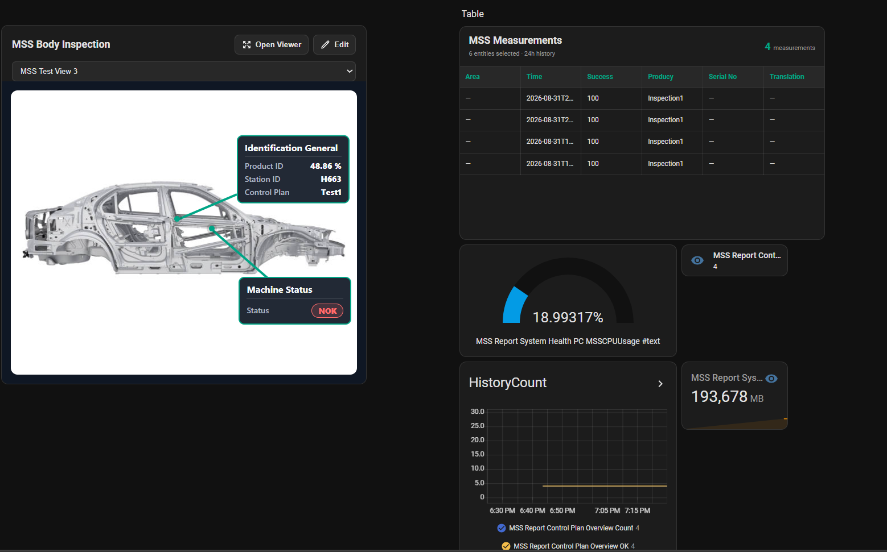
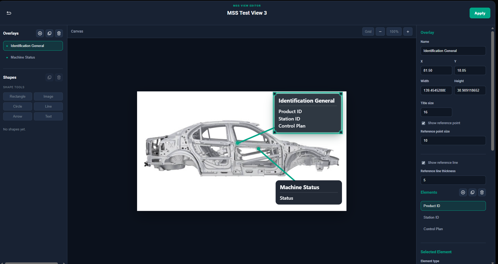

MSS Visualization for Home Assistant
====================================

MSS Visualization is a custom visualization layer built on top of Home Assistant Core.

It provides:

* Dynamic MSS MQTT sensor discovery
* Control Plan aware data grouping
* Dynamic measurement visualization
* MQTT image support
* Custom MSS views and overlays
* Automatic view routing
* Configurable shapes and data bindings
* Persistent local images and backgrounds
* Fullscreen visualization and editor interfaces

Repository overview
-------------------

This repository is a fork of the official Home Assistant Core repository.

Two Git remotes are normally used:

.. code-block:: text

   origin   → MSS project fork
   upstream → official Home Assistant Core

The main MSS development branch is:

.. code-block:: text

   feature/mss-visualization

The ``dev`` branch is kept aligned with the official Home Assistant ``dev`` branch.

Typical structure:

.. code-block:: text

   home-assistant/core upstream/dev
               │
               ▼
              dev
               │
               ▼
   feature/mss-visualization

MSS development should be performed on ``feature/mss-visualization``, not directly on ``dev``.

Development environment
-----------------------

Recommended setup:

* Windows 11
* Docker Desktop
* VS Code
* Dev Containers extension
* Git
* Mosquitto MQTT broker

VS Code is recommended because the repository already contains a Home Assistant Dev Container configuration.

The source code itself is not tied to VS Code, but the Dev Container provides the easiest reproducible Home Assistant development and test environment.

Setup
-----

Clone the repository:

.. code-block:: bash

   git clone https://github.com/davidspereira00-cmyk/home_core.git
   cd home_core
   git fetch origin
   git switch feature/mss-visualization

If the branch is not yet available locally:

.. code-block:: bash

   git switch -c feature/mss-visualization \
     --track origin/feature/mss-visualization

If the repository is private, the collaborator must first be added through GitHub repository access settings.

Open the Dev Container
----------------------

Open the cloned repository in VS Code.

Install the ``Dev Containers`` extension.

Then use:

.. code-block:: text

   Ctrl + Shift + P

and select:

.. code-block:: text

   Dev Containers: Reopen in Container

The repository should be available inside the container at:

.. code-block:: text

   /workspaces/home_core

The development container should be used for normal Home Assistant development and testing.

Current branch purpose
----------------------

``dev``

.. code-block:: text

   Clean Home Assistant Core base synchronized with upstream/dev

``feature/mss-visualization``

.. code-block:: text

   Latest Home Assistant Core
   +
   MSS Visualization development

MSS source copy vs Home Assistant runtime copy
----------------------------------------------

The project currently keeps **two copies of the MSS files for different purposes**.

This distinction is intentional and important.

Git-tracked MSS source
~~~~~~~~~~~~~~~~~~~~~~

The version tracked by Git lives here:

.. code-block:: text

   mss-visualization/

Structure:

.. code-block:: text

   mss-visualization/
   ├── custom_components/
   │   └── mss/
   │       ├── __init__.py
   │       ├── config_flow.py
   │       ├── manifest.json
   │       ├── sensor.py
   │       └── websocket.py
   │
   └── www/
       ├── mss/
       │   └── icons/
       ├── mss-default-views.js
       ├── mss-field-resolver.js
       ├── mss-icons.js
       ├── mss-measurements-card.js
       ├── mss-overlay-renderer.js
       ├── mss-panel-styles.js
       ├── mss-routing-status.js
       ├── mss-value-decoder.js
       ├── mss-view-card.js
       ├── mss-view-dialog.js
       ├── mss-view-editor-dialog.js
       ├── mss-view-renderer.js
       └── mss-view-router.js

This is the copy that should be:

* committed
* reviewed
* pushed
* shared with other developers
* used as the source-controlled MSS codebase

Home Assistant runtime copy
~~~~~~~~~~~~~~~~~~~~~~~~~~~

Home Assistant itself loads the MSS integration and frontend files from:

.. code-block:: text

   config/custom_components/mss/
   config/www/

These are the runtime locations used by the Home Assistant development instance.

The ``config/`` directory is ignored by Git because it contains local Home Assistant configuration, runtime data and machine-specific files.

Therefore:

.. code-block:: text

   mss-visualization/

is the **Git/source copy**, while:

.. code-block:: text

   config/

contains the **runtime copy used by Home Assistant**.

Current relationship:

.. code-block:: text

   Git-tracked source                         Home Assistant runtime
   ─────────────────────────────              ─────────────────────────────
   mss-visualization/www/              →      config/www/

   mss-visualization/
   custom_components/mss/              →      config/custom_components/mss/

At the moment these are separate physical copies.

Changes made only in ``mss-visualization/`` are not automatically reflected in ``config/``, and changes made only in ``config/`` are not automatically committed to Git.

When changing MSS code, make sure the relevant source and runtime copies remain synchronized.

A future improvement may replace the duplicated source files with selective symlinks or an automated sync process, while keeping runtime-generated image directories separate.

Why ``config/`` is not tracked
------------------------------

The Home Assistant development configuration contains local and runtime-specific content.

The repository therefore ignores:

.. code-block:: text

   /config

This means files such as:

.. code-block:: text

   config/www/
   config/custom_components/mss/

do not appear in Git status and are not pushed to GitHub.

The ``mss-visualization/`` folder was created specifically to provide a trackable source location for MSS.

Do not remove the global ``/config`` ignore rule simply to track MSS files.

Runtime images and backgrounds
------------------------------

MSS supports uploaded view backgrounds and local overlay images.

These are runtime-generated files and should remain outside normal source control.

Home Assistant writes them to:

.. code-block:: text

   config/www/mss-view-backgrounds/
   config/www/mss-view-images/

The corresponding paths under the tracked source tree are ignored:

.. code-block:: text

   /mss-visualization/www/mss-view-backgrounds/
   /mss-visualization/www/mss-view-images/

This is intentional.

Do not commit user-uploaded or generated runtime images unless a specific image is deliberately being added as a project asset.

For example, a fixed project asset such as:

.. code-block:: text

   mss-visualization/www/views/body.jpg

may be tracked.

Home Assistant custom component
-------------------------------

The MSS backend integration lives in:

.. code-block:: text

   mss-visualization/custom_components/mss/

The Home Assistant runtime equivalent is:

.. code-block:: text

   config/custom_components/mss/

Main files:

.. code-block:: text

   __init__.py
   config_flow.py
   manifest.json
   sensor.py
   websocket.py

Responsibilities include:

* MQTT processing
* dynamic MSS entities
* Control Plan grouping
* image field handling
* persistent structural schema
* MSS WebSocket commands
* view persistence
* local image/background upload handling

MSS frontend
------------

The source-controlled MSS frontend lives in:

.. code-block:: text

   mss-visualization/www/

The Home Assistant runtime equivalent is:

.. code-block:: text

   config/www/

Important frontend files include:

.. code-block:: text

   mss-view-editor-dialog.js
   mss-view-dialog.js
   mss-view-card.js
   mss-view-router.js
   mss-view-renderer.js
   mss-overlay-renderer.js
   mss-field-resolver.js
   mss-value-decoder.js
   mss-measurements-card.js
   mss-panel-styles.js
   mss-icons.js
   mss-default-views.js
   mss-routing-status.js

The Dazzle Line Icons used by MSS are stored under:

.. code-block:: text

   mss-visualization/www/mss/icons/

and have a corresponding runtime location under:

.. code-block:: text

   config/www/mss/icons/

Mosquitto and MQTT
------------------

MSS depends on MQTT and requires a reachable Mosquitto broker for live testing.

The existing development setup uses:

.. code-block:: text

   Port: 1883

Typical local broker address:

.. code-block:: text

   localhost:1883

The exact broker host depends on where Mosquitto is running.

Possible setups include:

* Mosquitto running on the host machine
* Mosquitto running in Docker
* Mosquitto running as a Home Assistant add-on in a full Home Assistant OS installation

For the Home Assistant Core Dev Container workflow, make sure the container can reach the configured broker.

MSS topics include:

.. code-block:: text

   MSSReport
   MSSReport_Test1
   MSSReport_Test2

The integration dynamically flattens incoming JSON and creates or updates MSS entities.

Live images are handled separately from normal Home Assistant sensor states.

Updating Home Assistant Core
----------------------------

The official Home Assistant repository is configured as:

.. code-block:: text

   upstream

To update the local ``dev`` branch:

.. code-block:: bash

   git switch dev
   git fetch upstream
   git pull --ff-only upstream dev

Verify that local ``dev`` matches the official Home Assistant branch:

.. code-block:: bash

   git rev-parse dev
   git rev-parse upstream/dev

The hashes should be identical.

Update the fork:

.. code-block:: bash

   git push origin dev

Updating the MSS branch after Home Assistant changes
----------------------------------------------------

After updating ``dev``:

.. code-block:: bash

   git switch feature/mss-visualization

Rebase the MSS work onto the latest Home Assistant version:

.. code-block:: bash

   git rebase dev

If conflicts occur:

#. Resolve the conflicted files.
#. Stage each resolved file:

   .. code-block:: bash

      git add <file>

#. Continue the rebase:

   .. code-block:: bash

      git rebase --continue

After a successful rebase, update the remote feature branch:

.. code-block:: bash

   git push --force-with-lease origin feature/mss-visualization

Use ``--force-with-lease``, not plain ``--force``.

Git remotes and safety
----------------------

Typical remote configuration:

.. code-block:: text

   origin   → https://github.com/davidspereira00-cmyk/home_core.git
   upstream → https://github.com/home-assistant/core.git

``origin`` is the MSS fork.

``upstream`` is used only to retrieve official Home Assistant changes.

MSS work should never be pushed to the official Home Assistant repository.

To make accidental upstream pushes harder, the upstream push URL can be disabled:

.. code-block:: bash

   git remote set-url --push upstream DISABLED

Check remotes:

.. code-block:: bash

   git remote -v

Home Assistant Core blocks direct commits to the ``dev`` branch through its pre-commit hooks.

Always make MSS changes on a feature branch.

Code quality
------------

Home Assistant Core uses pre-commit validation.

Before committing Python changes:

.. code-block:: bash

   ruff check mss-visualization/custom_components/mss/

Apply safe Ruff fixes when appropriate:

.. code-block:: bash

   ruff check mss-visualization/custom_components/mss/ --fix

After Ruff modifies files, stage them again:

.. code-block:: bash

   git add mss-visualization/custom_components/mss/

The normal commit command will also run Home Assistant's configured pre-commit checks.

Ruff version
------------

After pulling new Home Assistant changes, the required Ruff version may change.

Check:

.. code-block:: bash

   ruff --version

If the version in the active Home Assistant virtual environment is too old:

.. code-block:: bash

   uv pip install --upgrade ruff

Then check again:

.. code-block:: bash

   ruff --version

When multiple Ruff installations exist, inspect them with:

.. code-block:: bash

   which -a ruff

The Ruff executable inside the active ``ha-venv`` normally takes precedence.

Files that should not be committed
----------------------------------

Do not commit:

.. code-block:: text

   config/
   mss-visualization-test/
   mss-visualization-test.zip
   mss-visualization/www/mss-view-images/
   mss-visualization/www/mss-view-backgrounds/

The first is Home Assistant runtime configuration.

The test folder and ZIP are local test artifacts.

The image/background folders contain runtime-generated files.

Home Assistant |Chat Status|
============================

Open source home automation that puts local control and privacy first. Powered by a worldwide community of tinkerers and DIY enthusiasts. Perfect to run on a Raspberry Pi or a local server.

Check out `home-assistant.io <https://home-assistant.io>`__ for `a demo <https://demo.home-assistant.io>`__, `installation instructions <https://home-assistant.io/getting-started/>`__, `tutorials <https://home-assistant.io/getting-started/automation/>`__ and `documentation <https://home-assistant.io/docs/>`__.

|screenshot-states|

Featured integrations
---------------------

|screenshot-integrations|

The system is built using a modular approach so support for other devices or actions can be implemented easily. See also the `section on architecture <https://developers.home-assistant.io/docs/architecture_index/>`__ and the `section on creating your own components <https://developers.home-assistant.io/docs/creating_component_index/>`__.

If you run into issues while using Home Assistant or during development of a component, check the `Home Assistant help section <https://home-assistant.io/help/>`__ of our website for further help and information.

|ohf-logo|

.. |Chat Status| image:: https://img.shields.io/discord/330944238910963714.svg
   :target: https://www.home-assistant.io/join-chat/
.. |screenshot-states| image:: https://raw.githubusercontent.com/home-assistant/core/dev/.github/assets/screenshot-states.png
   :target: https://demo.home-assistant.io
.. |screenshot-integrations| image:: https://raw.githubusercontent.com/home-assistant/core/dev/.github/assets/screenshot-integrations.png
   :target: https://home-assistant.io/integrations/
.. |ohf-logo| image:: https://www.openhomefoundation.org/badges/home-assistant.png
   :alt: Home Assistant - A project from the Open Home Foundation
   :target: https://www.openhomefoundation.org/
